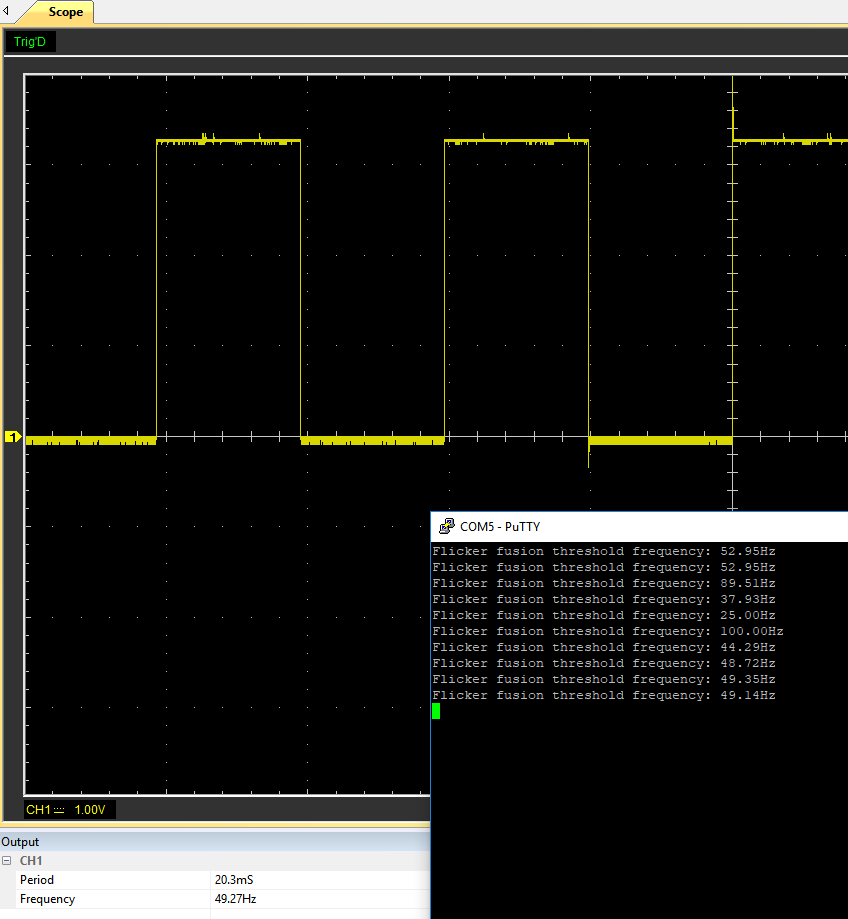
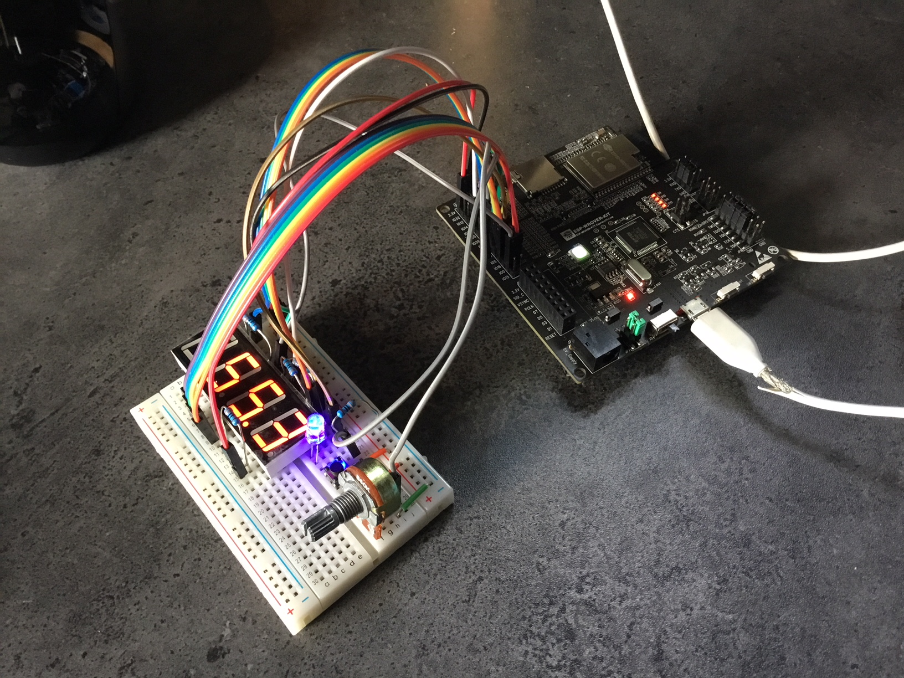

# weltec-flicker-fusion-threshold

Weltec MG7013 Project 0 - Teensy based human flicker fusion threshold determining system.

>"The flicker fusion threshold (or flicker fusion rate) is a concept in the psychophysics of vision. It is defined as the frequency at which an intermittent light stimulus appears to be completely steady to the average human observer."

*Flicker fusion threshold - Wikipedia. (n.d.). Retrieved March 15, 2017, from https://www.wikipedia.com/en/Flicker_fusion_threshold*

The implementation of the system to test this allows the user to adjust a potentiometer to increase or decrease the "flicker rate", the frequency, of an LED blinking on and off. The duty cycle of the flicker is always 50%. The system is designed to allow the user to vary the frequency between 25 and 100 Hz. When the user has determine the point at which they can *just* see a steady state of the LED a button is pressed which tells the user the frequency over a serial interface (USB: 115200 / 8N1).

## Design / Assembly
The design process itself was simple. From a hardware perspective it was clear what was required and from a software perspective it was simply a case of pulling together some button debouncing code, some ADC access code and using the system timer to drive the LED output frequency.  

### Components / BoM
| Supplier | Supplier Part # | # | Description       | MNF Part # |
|:---------|:---------------:|---|:------------------|:-----------|
|          |                 | 1 | Teensy 3.2        |            |
|          |                 | 1 | LED               |            |
|          |                 | 1 | 10k Potentiometer |            |
|          |                 | 1 | 330Ohm Resistor   |            |

**Note**: 330Ohm resistor for current limiting the LED. The Teensy supplies 3.3V on its GPIO pins and allows a maximum current draw of 25mA (ST Microelectronics, 2016). The LED is an unknown quantity so the max forward current is unknown as is it's voltage drop. Based on an assumed voltage drop of 2V (given it's a green LED), R = (Vs - Vf) / I = (3.3-2)/0.025 = 52 Ohms. But given we don't actually know, let's assume no voltage drop across the LED then this would give us 132 Ohm. A safety (and what was available in the box :) ) leaves us with a 330 Ohm resistor.

### Electronics
The components were wired up on breadboard as per the diagram below.

**Note**: It would appear that Fritzing's Teensy package has the VIN and 3.3V pins switched which is particularly frustrating when trying to get the schematic put together correctly. This is my first time using Fritzing so I haven't investigated this further.

The schematic was drawn up in Eagle as follows:

### Software

The code has been written to work with the Teensy 3.2 Arduino framework. This is slightly upgraded from the standard Arduino framework and provides "fast" versions of digitalRead for example. This has been taken advantage of on writing the interrupt routine that handles button presses so as not to significantly impede the execution of the interrupt routine which implements a software debounce of the button.

For interest the codebase was also adapted to work on the ESP32 Arduino framework so that debug facilities could be tested on the ESP32 Wrover Kit development board. There are again some subtle variations for the ESP32 implementation of the Arduino framework and these required the addition of a number of preprocessor directives to handle them.

**Note**: The default in platformio.ini is currently set to Teensy. Simply replace the `env_default = teensy31` with `env_default = esp-wrover-kit` to change the default to build and deploy to the ESP32 board instead.

## Results

Serial output looks like the following:

`Flicker fusion threshold frequency: 52.95Hz` 
`Flicker fusion threshold frequency: 52.95Hz` 
`Flicker fusion threshold frequency: 89.51Hz` 
`Flicker fusion threshold frequency: 37.93Hz` 
`Flicker fusion threshold frequency: 25.00Hz` 
`Flicker fusion threshold frequency: 100.00Hz` 
`Flicker fusion threshold frequency: 44.29Hz` 
`Flicker fusion threshold frequency: 48.72Hz` 

As can be seen, the frequency varies between 25 Hz and 100 Hz.

The calculated frequency output was tested against reality and found to be accurate to within ~0.2Hz. This can be seen in the oscillogram below:

## Conclusions
It turns out that my threshold is between about 49 and 53 Hz depending on ambient lighting conditions and how directly I'm looking at the LED. Interestingly, I believe it might be lower with a blue LED which I was experimenting with on the ESP32. Further investigation into whether the wavelength affects this phenomenon is warranted given further time.

Given the realisation that ambient lighting conditions have some affect, future experiments should be conducted in a consistently lit, probably dark, environment.

## Update
Since the first cut of this I have also rebuilt this on an ESP Wrover Kit (based on the ESP32 Wroom chip) and added a 7-segment display to show the frequency so that the user doesn't have to fire up a Terminal to find out. The resulting setup can be seen below:

In putting this together I found a frustrating lack of consolidated information about the ESP Wrover Kit board pinout so I've created a pinout map for it which can be found in the datasheets directory. I couldn't connect up one of the pins for the 4 digit 7-segment display in the end because I didn't have enough GPIO available with the setup that the wrover kit dev board uses (though in theory it's alterable with a little surgery). Also this is because I wanted the JTAG interface available, which steals some additional GPIO when it's enabled. Another couple of pins are used by the 32 KHz crystal on the board. Finally some are input only. Details can be found in the spreadsheet.

Secondly the button I used happen to be WAY more bouncy than the one I used on the Teensy so I had to increase the lockout to 100 ms (instead of only 2ms!). Works nicely now though. There are a number of other quirks of the Arduino framework implementation of the ESP32 I discovered along the way, which can be found in the codebase.

## References

**Note**: Some relevent datasheets can be found in the datasheets directory of this repository.

1. PJRC. (2018, August 24). Teensy 3.2 & 3.1: New Features. Retrieved from pjrc.com: https://www.pjrc.com/teensy/teensy31.html#specs
2. ST Microelectronics. (2016, September). STM32F415xx datasheet - production data; ARM Cortex-M4 32b MCU+FPU, 210DMIPS, up to 1MB Flash/192+4KB RAM, crypto, USB OTG HS/FS, Ethernet, 17 TIMs, 3 ADCs, 15 comm. interfaces & camera.

