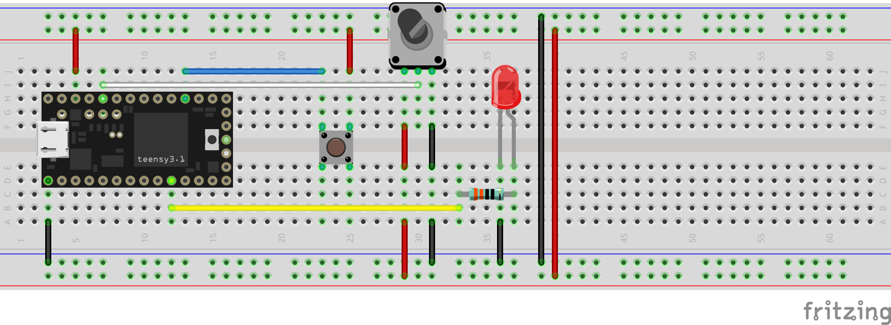
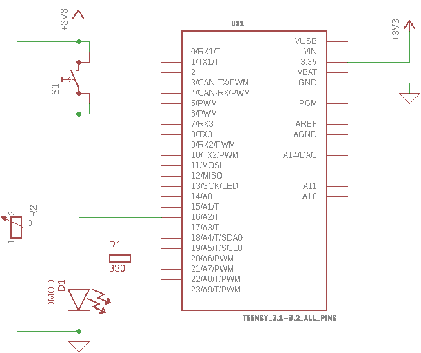

# weltec-flicker-fusion-threshold

Weltec MG7013 Project 0 - Teensy based human flicker fusion threshold determining system

## Electronics
The components were wired up on breadboard as per the diagram below.

**Note**: It would appear that Fritzing's Teensy package has the VIN and 3.3V pins switched which is particularly frustrating when trying to get the schematic put together correctly. This is my first time using Fritzing so I haven't investigated this further.

The schematic was drawn up in Eagle as follows:

